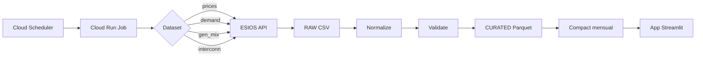

# tfm-energy-ingest


**Pipeline de ingesta y curación de datos del sistema eléctrico español (API e·sios/REE)**

Este repositorio implementa la capa de datos del TFM "Plataforma de visualización de datos energéticos públicos". Su propósito es:
- Cumplir con las condiciones de uso de e·sios: no consultar la API desde el frontend
- Servir datos desde infraestructura propia (GCS) con refresco horario/diario
- Garantizar calidad, trazabilidad y reproducibilidad mediante arquitectura medallion

---

## Contexto del TFM

### Problema
La volatilidad de precios eléctricos y la transición renovable han incrementado la necesidad de acceso simple y fiable a datos energéticos. Aunque REE publica datos vía e·sios, su dispersión y complejidad dificultan su uso por perfiles no técnicos.

### Solución (este repo)
Pipeline completo `ingesta → curación → app` que responde 10 preguntas clave sobre:
- **Precio**: horario, volatilidad, patrones (Q1, Q9, Q10)
- **Mix energético**: tecnologías, % renovable, horas "verdes" (Q2, Q3)
- **Relaciones**: precio↔renovables, precio↔interconexiones (Q4, Q6)
- **Previsiones**: demanda real vs prevista, errores (Q5)
- **Almacenamiento**: carga/descarga desde gen_mix (Q7)
- **Recomendaciones**: horas óptimas de consumo (Q8)

### Arquitectura de datos (medallion)
```
RAW (CSV/JSON)         → Inmutable, auditable, particionado por fecha
  ↓
CURATED (Parquet)      → Normalizado, Europe/Madrid, esquemas tabulares
  ↓
AGG/CACHE (futuro)     → Vistas día/semana/mes para acelerar la app
```

### Flujo de ejecución



**Decisiones clave:**
- **Parquet columnar**: lectura eficiente con DuckDB/gcsfs, compresión ZSTD, compatible con BigQuery/Spark
- **Particionado por fecha**: simplifica backfills DST-safe, alineado con granularidad horaria/minuto
- **UTC→Europe/Madrid**: consistencia temporal incluso en cambios de horario verano/invierno
- **Compaction mensual**: reduce micro-files (ingesta horaria) a 128-512 MB por mes, mejora rendimiento 10x

---

## Mapeo datasets → Preguntas TFM

| Dataset | Indicadores e·sios | Granularidad | Responde a | Tabla curated |
|---------|-------------------|--------------|------------|---------------|
| `prices_pvpc` | 1001 | Hora | Q1, Q4, Q8, Q10 | `prices` |
| `prices_spot` | 600 | Hora | Q1, Q4, Q8, Q10 | `prices` |
| `demand` | 2037, 2052, 2053 | Minuto | Q5, Q10 | `demand` |
| `gen_mix` | 2038-2051, 1152, 1172 | Minuto | Q2, Q3, Q4, Q7, Q8 | `gen_mix` |
| `interconn` | 2068-2076 | Minuto | Q6, Q10 | `interconn` |

**Nota Q7 (almacenamiento):** Se responde filtrando `gen_mix` por tecnologías `tech IN ('bombeo_turbinacion', 'bombeo_consumo')`. El cálculo de neto (descarga - carga) y análisis de patrones se realiza en la capa de visualización.

**Validaciones implementadas:**
- `validate_pvpc_complete_day`: asegura 23/24/25h según DST (Q1) con rangos plausibles
- `compute_mix_pct`: calcula % por tecnología sobre total hora/minuto (Q2, Q3)
- Dedupe por claves temporales + dimensiones para garantizar unicidad

---

## Requisitos
- Python 3.11
- GCP: Artifact Registry, Cloud Run Jobs, Secret Manager, Cloud Scheduler
- Secret `ESIOS_TOKEN` en Secret Manager
- Bucket GCS: `gs://energia-tfm-bucket` (configurable en `config/ingest.yaml`)

---

## Desarrollo local (opcional)
```bash
python -m venv .venv && source .venv/bin/activate
pip install -r requirements.txt
export ESIOS_TOKEN="TU_TOKEN"
python pipelines/ingest/main.py prices_pvpc
```

---

## Despliegue CI/CD
Configura en GitHub Secrets:
- `GCP_PROJECT_ID`
- `GCP_WORKLOAD_ID_PROVIDER`
- `GCP_CICD_SA`
- `GCP_JOBS_SA`

El workflow `.github/workflows/deploy.yml` construye la imagen y despliega los **Cloud Run Jobs** automáticamente en push a `main`.

---

## Programación (Cloud Scheduler)
Crea los cron para ejecutar los jobs:
- Horario: `ingest-prices-spot`, `demand`, `gen_mix`, `interconn`
- Diario 20:20: `ingest-prices-pvpc`

### Resumen de schedules actuales

| Nombre schedule | Cron | Estrategia ventana | Uso principal |
|-----------------|------|-------------------|---------------|
| hourly | `0 * * * *` | `last_hours` (6h rolling) | Precios spot (últimas horas) |
| pvpc_daily_20h | `20 20 * * *` | `next_day_dstsafe` (día siguiente) | PVPC día siguiente completo |
| minute_complete_20 | `20 * * * *` | `last_complete_hour_local` | Demanda / gen_mix / interconn (min) |

**Notas:**
- `last_complete_hour_local`: toma la hora completa previa al momento de ejecución (ej: se ejecuta 11:20 → ingiere 10:00–10:59 local convertida a UTC)
- `next_day_dstsafe`: expande rango para capturar el día local siguiente completo (23/24/25h según DST) y luego se filtra para escribir solo ese día

---

## Tipos de datasets y normalización

| Dataset | Tipo normalización | Granularidad RAW | Columna tiempo curated | Particularidades |
|---------|-------------------|------------------|------------------------|------------------|
| prices_pvpc | prices (filtra Península→España) | Hora (API) | `hour_ts` (Europe/Madrid) | Validador día completo, zona = España |
| prices_spot | prices | Hora | `hour_ts` | Fuente SPOT_ES |
| demand | wide_by_indicator | Minuto | `minute_ts` | Renombra 2037/2052/2053 a nombres descriptivos |
| gen_mix | long_tech + % | Minuto | `minute_ts` | Calcula `pct` de cada tecnología, incluye bombeo |
| interconn | interconn_pairs | Minuto | `minute_ts` | Export/import por país (FR/PT/MA/AD) |

---

## Flujo PVPC (cómo y cuándo se cargan los precios)
1. A las 20:20 (Europe/Madrid) se ejecuta `prices_pvpc` con ventana `next_day_dstsafe`, que pide un rango ampliado alrededor del día siguiente para cubrir cambios DST
2. Se normaliza: se queda solo con zona "Península" (renombrada a "España") y se genera `hour_ts` en hora local
3. Se filtra el dataframe para el día objetivo (día siguiente) y se valida:
   - Número de horas (23/24/25 aceptadas)
   - Valores dentro de rango plausible (-10 a 1000 €/MWh)
4. Se escribe una partición parquet (`prices`) y opcionalmente se pueden relanzar backfills para días antiguos con `--backfill-day` o `--backfill-range`

**Backfills PVPC:**
- `--backfill-day YYYY-MM-DD`: fuerza ventana tipo `today_dstsafe` sobre ese día y filtra a ese día
- `--backfill-range START:END` (inclusive): itera día a día aplicando la misma lógica; tolera DST

---

## Flujo datasets de minuto (demanda, mix, interconn)
- Se ejecutan a los :20 de cada hora (`minute_complete_20`)
- Ventana `last_complete_hour_local`: ingiere la hora previa completa (sin incluir la hora actual en curso)
- No hay solape adicional: se asume que a +20 min ya están todos los minutos de la hora cerrada publicados
- **Normalización:**
  - Demanda pivota indicadores y renombra a: `demanda_real_mw`, `demanda_prevista_h_mw`, `demanda_programada_h_mw`
  - Gen mix transforma a formato largo con tecnologías y calcula la proporción `pct` dentro de la suma de MW de la hora (o minuto en este caso) y zona. Incluye bombeo (IDs 1152, 1172) para Q7.
  - Interconexiones agrupa por país y determina `export_mw` / `import_mw`

---

## Columnas clave generadas
- `hour_ts`: timestamps horarios en Europe/Madrid (PVPC, SPOT)
- `minute_ts`: timestamps a minuto en Europe/Madrid (demanda, mix, interconn)
- `price_eur_mwh`, `demanda_real_mw`, `demanda_prevista_h_mw`, `demanda_programada_h_mw`, `mw`, `pct`, `export_mw`, `import_mw` según dataset
- `zone` o `country`/`tech` según el caso

---

## Flags/CLI disponibles
| Flag | Uso | Notas |
|------|-----|-------|
| `--local` | Escribe salidas en disco local (`paths_local`) | Sin credenciales GCS |
| `--target-date YYYY-MM-DD` | Forzar día base (estrategias DST-safe) | PVPC día siguiente / pruebas |
| `--backfill-day YYYY-MM-DD` | Reproceso de un día completo | Usa ventana `today_dstsafe` |
| `--backfill-range START:END` | Rango de días inclusivo | Itera día a día con DST-safe |
| `ESIOS_AUTH_MODE` (env) | `x-api-key` / `authorization` / `both` | Fallback de cabeceras |

---

## Estructura de salida
Se han simplificado los paths curated (sin particionar por `indicator_id` ni `zone`):
```
curated/<table>/year=YYYY/month=MM/day=DD/part-UUID.parquet
```
RAW conserva solo columnas esenciales (ver `raw_keep_columns` en config).

---

## Consideraciones DST
- Para PVPC se expande la ventana y luego se filtra a la fecha objetivo: evita perder horas (23) o duplicarlas (25) en cambios de horario
- Para minuto no se requiere ventana expandida porque sólo se toma la hora previa
- Todas las series se almacenan en UTC en raw y se convierten a Europe/Madrid en curated

---

## Buenas prácticas operativas
- Retraso de 20 minutos elegido para datasets de minuto: minimiza riesgo de registros tardíos
- Si en algún momento se observan minutos faltantes se podría añadir un job de "replay" o ampliar delay a 25
- Backfills masivos: usar rangos y, si se busca paralelizar, dividir por años/meses externamente
- Compactación: ejecutar mensualmente tras cierre de mes para consolidar micro-files

---

## Pruebas locales en Windows (PowerShell)
**Nota de zona horaria:**
- ESIOS devuelve `datetime` en UTC. Durante la normalización convertimos a `Europe/Madrid` y calculamos `hour_ts` en hora local (maneja CET/CEST y cambios de hora)

Estas instrucciones permiten probar cada carga (dataset) desde tu máquina usando PowerShell. Las cargas disponibles están definidas en `config/ingest.yaml` bajo `datasets`:
- `prices_pvpc` (ejecución diaria 20:20 para el día siguiente; soporta backfill de días completos)
- `prices_spot`
- `demand`
- `gen_mix`
- `interconn`

### 1) Preparar entorno Python

```powershell
python -m venv .venv
.\.venv\Scripts\Activate.ps1
pip install -r requirements.txt
```

### 2) Variables de entorno necesarias

- `ESIOS_TOKEN`: API key de ESIOS (obtener desde su portal)
- `GOOGLE_APPLICATION_CREDENTIALS`: ruta al JSON de cuenta de servicio con permisos de escritura en el bucket GCS definido en `config/ingest.yaml` (`paths.bucket`)
- (Opcional) `GCLOUD_PROJECT`: ID de tu proyecto GCP

Ejemplo:

```powershell
$env:ESIOS_TOKEN = "TU_TOKEN_ESIOS"
$env:GOOGLE_APPLICATION_CREDENTIALS = (Resolve-Path ".\tfm-energia-streamlit-cloud-814352512664.json").Path
$env:GCLOUD_PROJECT = "tu-proyecto-gcp"  # opcional
```

**Importante:**
- Verifica/ajusta `paths.bucket` en `config/ingest.yaml` para GCS (por defecto: `gs://energia-tfm-bucket`)
- También puedes activar modo local que escribe en disco (ver más abajo)

### 3) Smoke test rápido de conectividad a ESIOS (opcional)

```powershell
python .\scripts\test.py
```

Deberías ver código 200 y un pequeño resumen de las columnas/zonas.

### 4) Ejecutar cada carga manualmente

La CLI es: `python pipelines/ingest/main.py <dataset> [--target-date YYYY-MM-DD]`

**Notas de ventana temporal:**
- Por defecto la mayoría usa `last_hours: 6` (UTC) definido en `config/ingest.yaml`
- Las cargas con estrategia DST-safe admiten `--target-date` para fijar el día objetivo en Europa/Madrid

Comandos ejemplo (PowerShell):

```powershell
# PVPC: ejecutar "día siguiente" (lo que hace el job diario de 20:20)
python .\pipelines\ingest\main.py prices_pvpc --target-date $((Get-Date).ToString('yyyy-MM-dd'))

# PVPC: backfill de un día completo anterior (DST-safe)
python .\pipelines\ingest\main.py prices_pvpc --backfill-day 2025-09-20

# Precio spot ES (OMIE, id=600) últimas horas
python .\pipelines\ingest\main.py prices_spot

# Demanda real vs. prevista (ancho por indicador) últimas horas
python .\pipelines\ingest\main.py demand

# Mix de generación por tecnología (largo, minuto) hora completa previa
python .\pipelines\ingest\main.py gen_mix

# Interconexiones por país (minuto) hora completa previa
python .\pipelines\ingest\main.py interconn
```

**Salida esperada:**
- Imprime rutas `RAW -> gs://.../raw/...csv` y `CURATED -> gs://.../curated/...parquet` que se han escrito
- Warnings informativos (por ejemplo, validación de PVPC día completo) pueden aparecer y no frenan la ejecución

#### Modo local (sin GCS)

Puedes escribir los resultados en disco local usando `--local`. Las rutas locales se controlan en `config/ingest.yaml` bajo `paths_local`.

Ejemplos:

```powershell
# PVPC últimas horas, salida en ./data
python .\pipelines\ingest\main.py prices_pvpc --local

# PVPC de mañana (DST-safe) a disco local
python .\pipelines\ingest\main.py prices_pvpc --target-date $((Get-Date).AddDays(1).ToString('yyyy-MM-dd')) --local
```

Configuración por defecto de `paths_local`:

```yaml
paths_local:
  root: "./data"
  raw: "{root}/raw/{dataset}/year={year}/month={month}/day={day}/{dataset}_{iso_run}.csv"
  curated: "{root}/curated/{table}/year={year}/month={month}/day={day}/part-{uuid}.parquet"
```

### 5) Ajustar ventana temporal

Para ampliar o reducir el rango horario, edita `config/ingest.yaml` en la sección del dataset (clave `window_strategy`). Ejemplo para 24 horas:

```yaml
window_strategy: { type: "last_hours", hours: 24 }
```

Para ejecuciones diarias con horario de verano/invierno, usa `--target-date` (día base para calcular el "día siguiente"). Para backfill de un día ya pasado usa `--backfill-day` que fuerza ventana `today_dstsafe`.

### 6) Problemas comunes y soluciones

- **HTTP 401/403**: token inválido o cabeceras no aceptadas. Revisa `ESIOS_TOKEN` y vuelve a intentar
- **403 persistente**: prueba con distintos modos de autenticación:
  ```powershell
  # Solo x-api-key
  $env:ESIOS_AUTH_MODE = "x-api-key"
  python .\pipelines\ingest\main.py prices_pvpc --local
  # Solo Authorization
  $env:ESIOS_AUTH_MODE = "authorization"
  python .\pipelines\ingest\main.py prices_pvpc --local
  # Ambos (por defecto)
  $env:ESIOS_AUTH_MODE = "both"
  ```
- **429/Rate limit**: el cliente aplica throttling; aumenta `defaults.rate_limit_per_sec` si tienes margen
- **Errores GCS (permisos/bucket)**: comprueba `GOOGLE_APPLICATION_CREDENTIALS`, que el bucket exista y que el SA tenga rol `Storage Object Admin` al menos
- **DST**: para PVPC de mañana usa siempre `--target-date` para evitar pérdidas o duplicados de hora

---

## Ejecución con Docker (opcional)

La imagen ahora expone un entrypoint unificado (`entrypoint.py`) que acepta un primer argumento de modo:

```
  ingest  -> pipelines/ingest/main.py
  compact -> pipelines/ingest/compact.py
  qc      -> scripts/qc_month.py
```

Construir imagen:

```powershell
docker build -t tfm-energy-ingest:local -f docker/Dockerfile .
```

### Ingesta (ejemplo interconn rango de días)
```powershell
$CredFile = "tfm-energia-streamlit-cloud-814352512664.json"
docker run --rm `
  -e ESIOS_TOKEN=$env:ESIOS_TOKEN `
  -e GOOGLE_APPLICATION_CREDENTIALS=/app/$CredFile `
  -v ${PWD}:/app -w /app `
  tfm-energy-ingest:local `
  ingest interconn --backfill-range 2025-09-01:2025-09-03
```

### Ingesta modo local
```powershell
docker run --rm -e ESIOS_TOKEN=$env:ESIOS_TOKEN -v ${PWD}:/app -w /app tfm-energy-ingest:local `
  ingest prices_pvpc --backfill-day 2025-09-20 --local
```

### Compactación (último mes cerrado de una tabla)
```powershell
docker run --rm -e GOOGLE_APPLICATION_CREDENTIALS=/app/$CredFile -v ${PWD}:/app -w /app tfm-energy-ingest:local `
  compact --dataset interconn --months-back 1 --dry-run
```

### Compactación mes específico y borrado de micro-files
```powershell
docker run --rm -e GOOGLE_APPLICATION_CREDENTIALS=/app/$CredFile -v ${PWD}:/app -w /app tfm-energy-ingest:local `
  compact --dataset interconn --month 2025-09 --delete-originals
```

### Compactar todos los datasets últimos 3 meses
```powershell
docker run --rm -e GOOGLE_APPLICATION_CREDENTIALS=/app/$CredFile -v ${PWD}:/app -w /app tfm-energy-ingest:local `
  compact --months-back 3 --dry-run
```

### QC mensual (recuento y duplicados estimados)
```powershell
docker run --rm -v ${PWD}:/app -w /app tfm-energy-ingest:local `
  qc interconn 2025 09 --gcs-root gs://energia-tfm-bucket
```

**Notas:**
1. Si montas todo el repo en `/app` el `entrypoint.py` existe también en la raíz, evitando que se pierda al hacer bind mount
2. `ESIOS_TOKEN` no es necesario para compactación ni QC; se mostrará un warning si falta (se puede ignorar)
3. Para ejecución sólo sobre GCS sin escribir local puedes omitir el bind mount y pasar solo credenciales

---

## Smoke de todos los datasets (local)

Ejecuta todas las cargas habilitadas en `config/ingest.yaml` con salida local y resumen final:

```powershell
python .\scripts\smoke_all.py
```

Filtrar datasets y forzar modo de autenticación ESIOS:

```powershell
python .\scripts\smoke_all.py --only prices_pvpc demand --auth-mode x-api-key
```

---

## Backfill por rangos (inicial: 3 años)

- Rango directo (inclusive):
```powershell
python .\pipelines\ingest\main.py prices_pvpc --backfill-range 2022-09-21:2025-09-20 --local
```

- Generar "últimos 3 años" dinámico en PowerShell y lanzar por rango:
```powershell
$end = Get-Date
$start = $end.AddYears(-3)
python .\pipelines\ingest\main.py prices_pvpc --backfill-range $($start.ToString('yyyy-MM-dd')):$($end.AddDays(-1).ToString('yyyy-MM-dd')) --local
```

**Nota:** el backfill procesa día a día en modo `today_dstsafe` para respetar cambios de hora.

---

## Compactación mensual de datos curated

**Problema:** la ingesta diaria (o horaria) genera muchos micro-ficheros Parquet (uno por ejecución / partición día). Esto degrada el rendimiento de motores como DuckDB / Spark / BigQuery al aumentar el overhead de metadata & file listing.

**Objetivo:** consolidar todos los ficheros de un mes cerrado en un único `compact.parquet` (tamaño orientativo 128-512 MB) para cada tabla curated (`prices`, `demand`, `gen_mix`, `interconn`).

**Script:** `python pipelines/ingest/compact.py`

### Estrategia
1. Detectar meses "cerrados" (todas las particiones `year=YYYY/month=MM` distintos del mes actual) salvo que se use `--include-current`
2. Leer todos los Parquet del mes (excluyendo uno existente `compact.parquet`)
3. Ordenar por columna temporal disponible (`minute_ts` > `hour_ts` > `datetime`)
4. Deduplicar por claves inferidas: `(minute_ts, zone, tech)` para gen_mix, `(minute_ts, country)` para interconn, `(hour_ts, zone, source)` para prices, etc.
5. Escribir `compact.parquet` con compresión ZSTD y `row_group_size=50_000`
6. (Opcional) Borrar micro-files (`--delete-originals`) tras validación implícita (el número de filas resultante es la suma de las fuentes tras dedupe)

### Uso básico (PowerShell)

```powershell
# Dry-run (no escribe) sobre todas las tablas cerradas
python .\pipelines\ingest\compact.py --dry-run

# Compactar sólo tabla prices (meses cerrados)
python .\pipelines\ingest\compact.py prices

# Incluir mes en curso (si necesitas recomputar parcial)
python .\pipelines\ingest\compact.py prices --include-current

# Forzar sobrescritura si ya existe compact.parquet
python .\pipelines\ingest\compact.py prices --force

# Eliminar micro-files tras compactar (ATENCIÓN: operación destructiva)
python .\pipelines\ingest\compact.py prices --delete-originals --force

# Limitar a los últimos 2 meses cerrados
python .\pipelines\ingest\compact.py prices demand --months-back 2

# Modo local usando ./data/curated
python .\pipelines\ingest\compact.py --local --dry-run
```

### Flags disponibles

| Flag | Descripción |
|------|-------------|
| (tables) | Lista de tablas curated a procesar. Vacío = todas detectadas en config |
| `--dataset X` | Alias repetible para indicar tablas (equivalente a posicional) |
| `--month YYYY-MM` | Limita el procesamiento a un único mes concreto |
| `--include-current` | Incluye el mes en curso (por defecto se ignora) |
| `--months-back N` | Limita a los últimos N meses cerrados (después de filtros) |
| `--force` | Sobrescribe `compact.parquet` existente |
| `--delete-originals` | Elimina micro-files tras éxito (no recomendado hasta validar flujo) |
| `--local` | Opera sobre `paths_local.curated` |
| `--dry-run` | No escribe ni borra; muestra acciones |

### Programación recomendada (Cloud Scheduler)

| Frecuencia | Cron sugerido | Acción |
|------------|--------------|--------|
| Mensual | `0 2 1 * *` | Compactar todos los meses cerrados (mes anterior) |
| Semanal (higiene) | `0 3 * * 1` | Recompactar últimos 2-3 meses para capturar cargas retrasadas |

Cloud Run Job: construir una imagen que contenga el script (ya presente) y ejecutar comando:

```bash
python pipelines/ingest/compact.py --months-back 3 --force
```

---

## Lint & Tests

Para mantener calidad y detectar errores pronto:

### Lint (Ruff)
Analiza estilo, errores comunes (Pyflakes) y orden de imports.

Comandos:
```powershell
make lint        # Chequeo
make lint-fix    # Aplica fixes automáticos
make format      # Formateo (similar a black + isort integrados en ruff)
```

### Tests (Pytest)
Ejecución de pruebas unitarias / smoke:
```powershell
make test
```

Actualmente sólo hay un `test_smoke.py` que verifica que el script principal y `compact.py` se importan/ejecutan. Añade más tests creando archivos en `tests/` con prefijo `test_`.

**Buenas prácticas:**
* Añade un test por bug corregido para evitar regresiones
* Usa fixtures para reutilizar datos fake
* Para pruebas de red, simula (mock) respuestas de la API ESIOS

---

## Arquitectura & Flujo de Ejecución

Componentes principales:

| Archivo / Módulo | Rol | Cuándo se ejecuta |
|------------------|-----|--------------------|
| `pipelines/ingest/main.py` | Punto de entrada CLI de ingesta | Manual o por Cloud Run Job (Scheduler) |
| `pipelines/ingest/compact.py` | Compactación mensual/semanal | Manual o Scheduler (Cloud Run Job) |
| `pipelines/ingest/esios_client.py` | Cliente HTTP ESIOS con throttling/auth fallback | Importado por `main.py` cuando se lanza ingesta |
| `pipelines/ingest/normalize.py` | Funciones de normalización de datasets | Import al iniciar ingesta; ejecuta solo funciones llamadas |
| `pipelines/ingest/hooks.py` | Hooks de post-proceso / validadores | Llamados según config (`post_hook`, `validators`) |
| `config/ingest.yaml` | Config declarativa (datasets, ventanas, paths) | Leído cada vez que se invoca `main.py` o `compact.py` |
| `scripts/qc_month.py` | Quality Check mensual | Manual o Cloud Run Job |
| `docker/entrypoint.py` | Entrypoint unificado contenedor | Al arrancar contenedor Docker |
| `.github/workflows/deploy.yml` | Pipeline CI/CD | Push a main o release |

### Ciclo de vida de una ingesta (ejemplo `gen_mix`)
1. Cloud Scheduler dispara un Cloud Run Job (cron :20 cada hora) → Contenedor arranca y ejecuta: `python pipelines/ingest/main.py gen_mix`
2. `main.py` lee `config/ingest.yaml` y selecciona dataset
3. Calcula ventana temporal (`resolve_window`) según estrategia (`last_complete_hour_local`)
4. Llama al cliente ESIOS para cada `indicator_id` (con retries y fallback de cabeceras)
5. Concatena y trimea columnas RAW → escribe CSV (raw partition) si no está vacío
6. Normaliza según `kind` (long_tech), aplica hook `compute_mix_pct` y validadores
7. Filtra a la hora objetivo (manejo DST) → dedup por `(minute_ts, zone, tech)

---

## Documentación adicional

- **[Guía completa de API PVPC](pvpc_api_guide.md)**: Solución de problemas comunes, mejores prácticas y validaciones para obtener datos completos de ESIOS